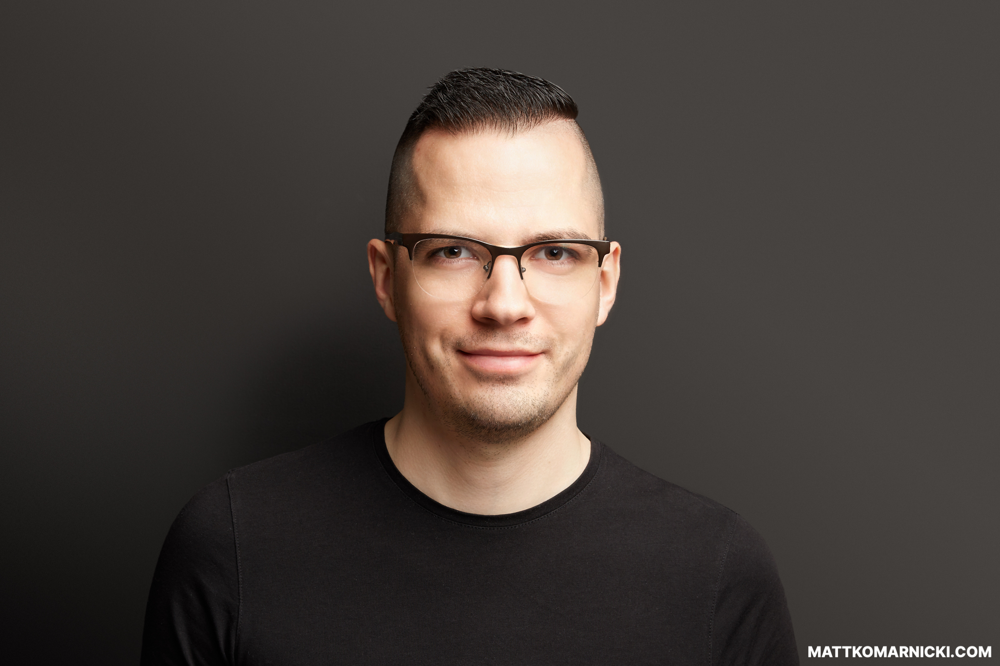

# Hi there!

#### I'm Matt - Software Architect who crafts highly scalable, multi-tenant, SaaS and cloud-based applications.

I am an easy-going guy who loves to work with creative individuals on challenging projects using suitable technologies. 
I like to share my knowledge with others, mentor, inspire and collaborate with my work mates.

While I prefer to stick within realm of backend code, I do enjoy working on a visual layer of each project as well. 
I consider myself a person with decent graphic taste in terms of UX/UI and styling things in general.

If you want to find out more about me, then check out my [Personal Website](https://mattkomarnicki.com), [Twitter](https://twitter.com/mattkomarnicki) or [LinkedIn](https://linkedin.com/in/mattkomarnicki).

You can drop me a line through [my contact form](https://mattkomarnicki.com/contact).

Thanks for visiting!
